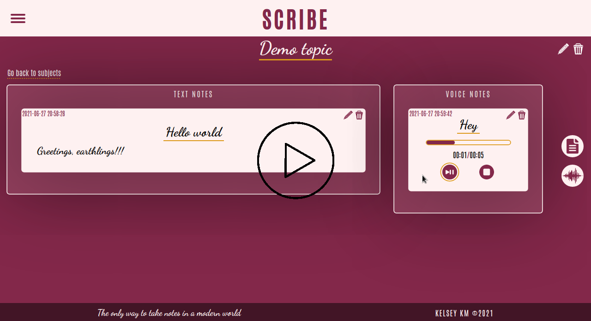

# **scribe2**
*The only way to take notes in a modern world*

* Scribe is a web application that allows you to take both voice and text notes.
* Users have accounts, which they sign up for, or log into.
* The application is structured thus:
  ```
  Subject
  |_
    Sections
    |_
      Topics
      |_
        Notes (text/voice)
  ```

### **Installation**
* Ensure you have Node installed.
* ```cd``` into the directory containing the ```package.json``` file and run ```npm install``` to install all the dependencies.
* Make a directory called ```certs```, ```cd``` into it and run ```openssl req -x509 -newkey rsa:4096 -keyout key.pem -out cert.pem -days 365```
* Put the passphrase of the private key generated in the ```.env``` file.
* Provide a *session secret* in the ```.env``` file.
* Run ```npm run build``` to build the application.
* The application uses ports 80 and 443, so run the following command as root or with sudo to allow node access to priviledged ports:
  ```
  setcap 'cap_net_bind_service=+ep' [PATH TO NODE]
  ```
  Replace the ```[PATH TO NODE]``` with the path to your local node. If you don't know it, the command ```which node``` or ```type node``` will help.
  Make sure the path points to the actual node file and not a symlink.

### **Start up**
* To start the app, ```cd``` into the directory with the app and run ```npm run start```
* In your browser, navigate to ```https://localhost```

###### *Demo video*
[](https://youtu.be/042gBdWzMg0 "scribe2 demo")
